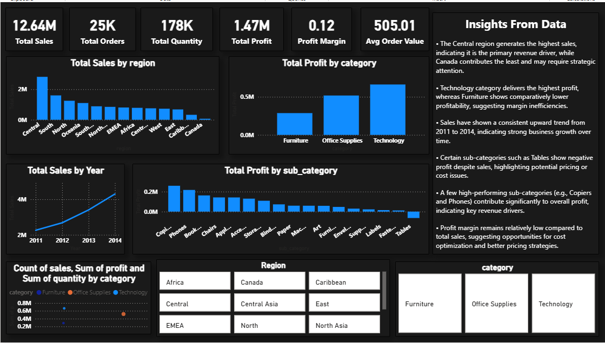

# 📊 Sales & Profitability Dashboard

## 📌 Overview
This project presents an interactive **Sales and Profitability Dashboard** built using Power BI to analyze business performance across regions, categories, and customers. The dashboard enables dynamic filtering and helps uncover key insights related to revenue, profit, and operational efficiency.

---

## 🎯 Problem Statement
Businesses often struggle to identify which products, regions, and customers are truly profitable.  
This project aims to analyze sales data to uncover:
- High-performing vs underperforming regions  
- Profitability across product categories  
- Loss-making products despite high sales  

---

## 🛠️ Tools & Technologies
- Power BI  
- Excel  
- Power Query  
- DAX  

---

## 📊 Key KPIs
- Total Sales  
- Total Profit  
- Profit Margin  
- Total Orders  
- Average Order Value  

---

## 🎛️ Dashboard Features
- Interactive slicers (Region, Category, Customer, Date)  
- Drill-down analysis (Category → Sub-category)  
- Sales vs Profit comparison (Scatter Plot)  
- Time-based trend analysis  
- Conditional formatting for profit visualization  

---

## 🧠 Key Insights
- Central region contributes the highest share of total sales, while some regions underperform  
- Technology category generates the highest profit, whereas Furniture shows lower profitability  
- Certain sub-categories (e.g., Tables) incur losses despite strong sales  
- Sales show consistent growth over time, indicating increasing demand  
- Profit contribution is concentrated in a few high-performing products  

---

## 🖼️ Dashboard Preview

---

## 🚀 Business Impact
- Helps identify cost inefficiencies and loss-making products  
- Enables data-driven decision-making  
- Improves understanding of customer and regional performance  

---

## 🔗 Project Files
- Power BI Dashboard (.pbix)  
- Dataset (CSV)  

---

## 📎 How to Use
1. Download the `.pbix` file  
2. Open in Power BI Desktop  
3. Use slicers to explore insights dynamically  
